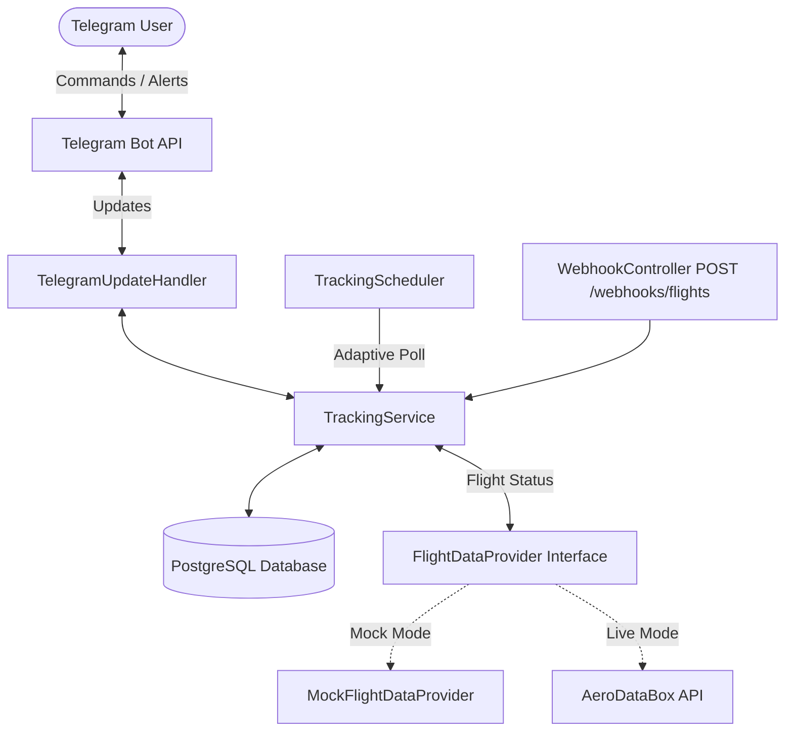

# Adaptive Flight Tracking Bot

[](https://www.oracle.com/java/)
[](https://spring.io/projects/spring-boot)
[](https://www.postgresql.org/)
[](https://www.docker.com/)
[](LICENSE)

A high-reliability, single-user Telegram bot built with **Java 21 / Spring Boot 3.x** and **PostgreSQL** that tracks commercial flights and delivers real-time Telegram notifications when a flight lands.

### Technical Motivation

Monitoring flight arrivals manually via web interfaces or flight tracking apps requires constant status refreshing and manual polling. This bot automates flight monitoring by substituting manual status checks with an automated, adaptive polling engine and instant push alerts on Telegram upon touchdown.

---

## Features

- **Telegram Bot Interface**: Track, inspect, and cancel flight monitoring directly via Telegram commands.
- **Single-User Architecture**: Intentionally single-user for minimal complexity, low operating cost, and zero-maintenance reliability. Access is strictly gated to `TELEGRAM_ALLOWED_CHAT_ID`. *(Note: Multi-tenant support could be added by introducing user authentication, chat-isolated database models, and per-tenant quota enforcement).*
- **Pluggable Provider Abstraction**: Decoupled behind the `FlightDataProvider` interface. Supports AeroDataBox (RapidAPI) for live aviation feeds and a built-in Mock Provider for offline testing.
- **Adaptive Polling Engine**: Dynamically adjusts polling frequency based on time-to-departure to minimize API credit consumption:
  - **> 24 hours out**: Polls every 6 hours
  - **24 – 6 hours out**: Polls every 2 hours
  - **6 – 2 hours out**: Polls every 30 minutes
  - **< 2 hours to landing**: Polls every 10 minutes
- **Event-Driven Webhooks**: Optional endpoint (`POST /webhooks/flights`) for providers supporting push notifications.
- **Idempotent Landing Alerts**: Database-enforced status flags guarantee exactly one landing notification per flight event, avoiding duplicate messages even after application restarts.
- **Database Migrations**: Managed via Flyway schema migrations.

---

## Architecture



---

## Telegram Commands

| Command | Description | Example |
| :--- | :--- | :--- |
| `/start` / `/help` | Displays bot welcome message and command list | `/start` |
| `/track <flight>` | Normalizes and starts tracking today's flight | `/track AI171` |
| `/tracked` | Lists all active tracked flights sorted by arrival | `/tracked` |
| `/status <flight>` | Queries live flight status from provider | `/status AI171` |
| `/cancel <flight>` | Stops tracking specified flight | `/cancel AI171` |
| `/cancel_all` | Stops tracking all active flights | `/cancel_all` |

---

## Quick Start (Local Setup)

### Prerequisites

- Docker Desktop or Docker Compose
- Maven (optional for non-containerized builds)

### 1. Clone & Configure

```bash
git clone https://github.com/abhudaym/flight-tracker-bot.git
cd flight-tracker-bot

cp .env.example .env
```

Edit `.env` with your credentials:

```env
DATABASE_URL=jdbc:postgresql://postgres:5432/flighttracker
DATABASE_USERNAME=flighttracker
DATABASE_PASSWORD=flighttracker_secret_pass_123

TELEGRAM_BOT_TOKEN=123456789:ABCdefGhIJKlmNoPQRsTUVwxyZ
TELEGRAM_ALLOWED_CHAT_ID=123456789

# Provider choice: 'mock' (free testing) or 'aerodatabox' (live flight data)
FLIGHT_PROVIDER=mock
FLIGHT_TIMEZONE=Asia/Kolkata
AERODATABOX_API_KEY=your_rapidapi_key_here
```

### 2. Run with Docker Compose

```bash
docker compose up -d --build
```

This starts:
- PostgreSQL 16 container on port `5432`
- Spring Boot 3.3.4 application container on port `8080`

View live application logs:
```bash
docker compose logs -f app
```

---

## Cloud Deployment (Google Cloud Platform)

To keep the bot running 24/7 on Google Cloud Compute Engine (Always Free Tier):

1. Create a GCP Compute Engine VM:
   - **Machine Type**: `e2-micro` (1 vCPU, 1 GB memory)
   - **Region**: `us-central1` (Iowa), `us-east1` (South Carolina), or `us-west1` (Oregon)
   - **Boot Disk**: Ubuntu 22.04 LTS (30 GB Standard Persistent Disk)
2. SSH into your VM and install Docker:
   ```bash
   curl -fsSL https://get.docker.com | sh
   sudo usermod -aG docker $USER
   newgrp docker
   ```
3. Clone repository and run:
   ```bash
   git clone https://github.com/abhudaym/flight-tracker-bot.git
   cd flight-tracker-bot
   cp .env.example .env
   nano .env
   docker compose up -d --build
   ```

Containers are configured with `restart: unless-stopped` so services automatically start on VM reboots.

---

## Configuration Parameters

| Property | Environment Variable | Default | Description |
| :--- | :--- | :--- | :--- |
| `spring.datasource.url` | `DATABASE_URL` | `jdbc:postgresql://localhost:5432/flighttracker` | Database connection URL |
| `telegram.bot-token` | `TELEGRAM_BOT_TOKEN` | - | Bot HTTP API token from @BotFather |
| `telegram.allowed-chat-id` | `TELEGRAM_ALLOWED_CHAT_ID` | `0` | Your Telegram Chat ID |
| `flight.provider` | `FLIGHT_PROVIDER` | `mock` | Flight data provider (`mock` or `aerodatabox`) |
| `flight.timezone` | `FLIGHT_TIMEZONE` | `Asia/Kolkata` | Local timezone for user display |
| `aerodatabox.api-key` | `AERODATABOX_API_KEY` | - | RapidAPI key for AeroDataBox |

---

## Testing

Run the unit and integration test suite:

```bash
mvn clean test
```

Includes unit tests for flight number normalization, state transitions, idempotency, command parsing, and Spring Boot integration tests with H2 database.

---

## License

Distributed under the MIT License. See `LICENSE` for details.
